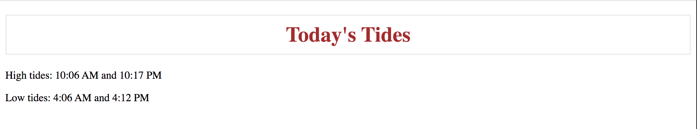

# Harbor Tides

### Purpose

Simple little project to practice web scraping. Gets tidal data for a specified harbor from www.usharbors.com.

### To Run:

1. Run `python3 ./get_tides.py`
2. When prompted, enter a harbor and the two-letter abbreviation or full name of the state in which it is located. If the state you entered is invalid or does not border the ocean, you will be prompted to enter a new state.
3. Based on your input harbor and state, the program generates a search url and attempts to navigate to the tides tab for your harbor of interest on www.usharbors.com. If your search url is invalid, you will be asked if you want to try again with a new state/harbor or quit the program. If your search url is valid, the program will grab the tide table html.
4. Prints today's high tide times, low tide times, and sunrise/sunset times to stdout.
   

### Next steps:

- Clean up the code
- Add unittests
- Add commands to allow user more control in specifying the date and data they want to grab
- Allow ability to parse other websites for supplementary information (ex. check air/water temp and wind speeds at a specific weather buoy)
